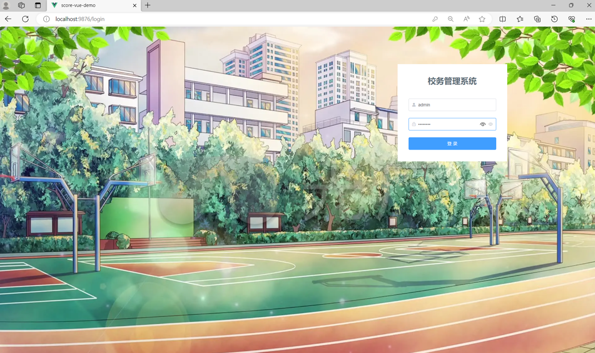
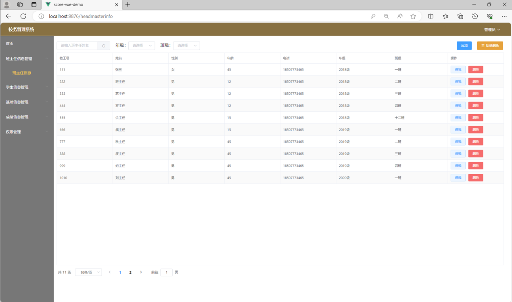
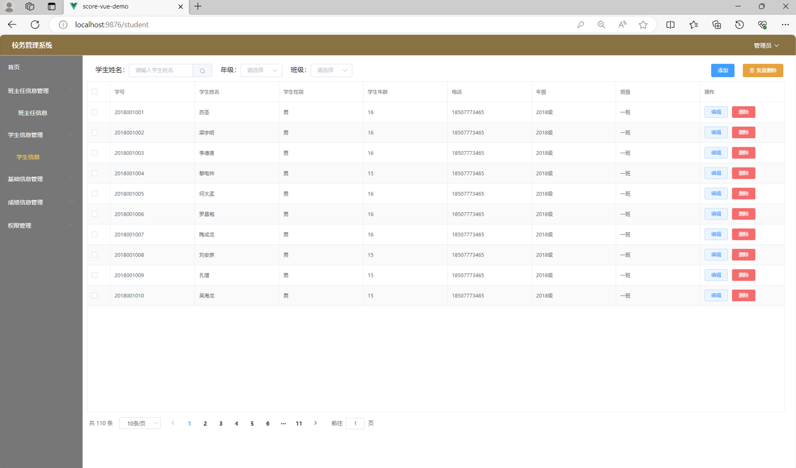
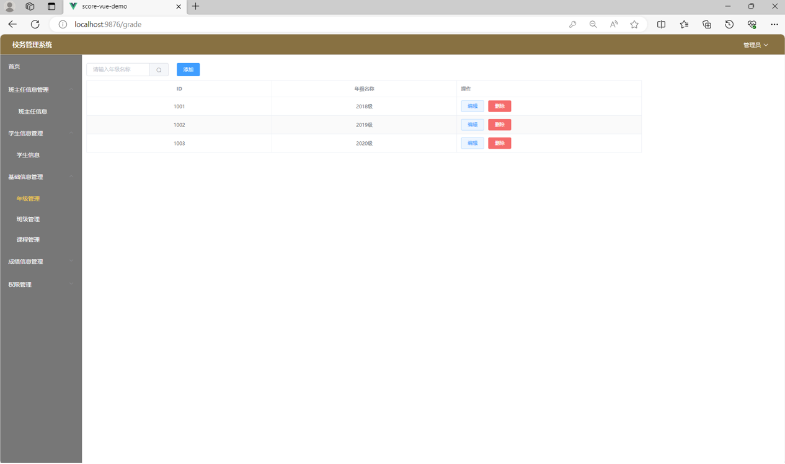
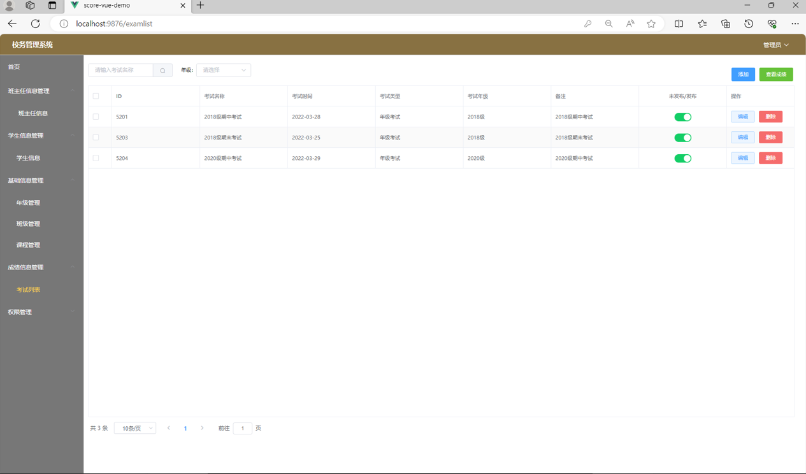
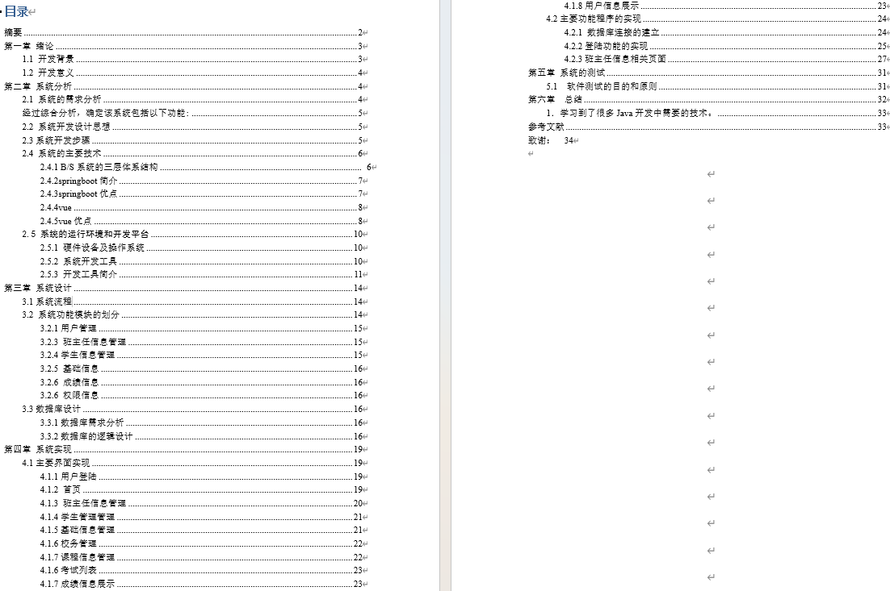
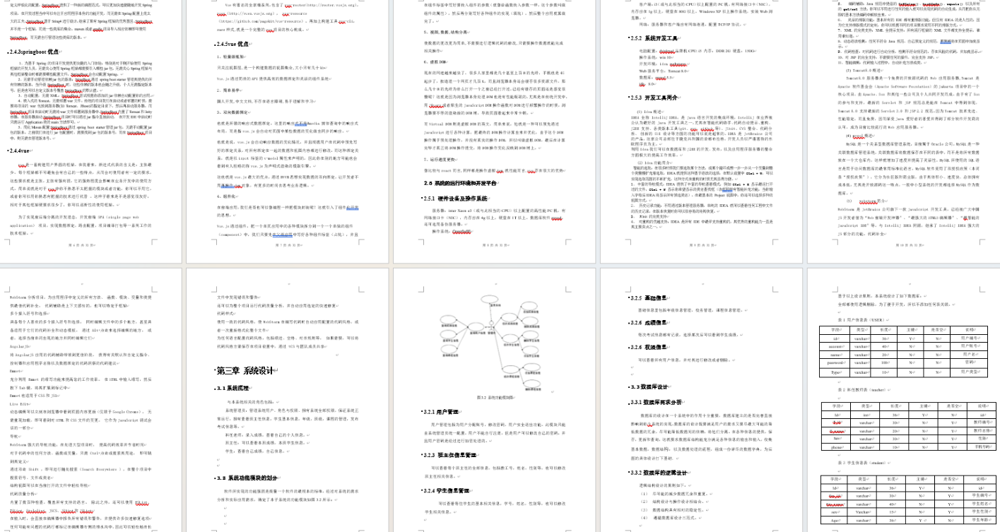

# 学校校务管理系统

### 9.9￥ 获取完整源码+sql，附赠10000字论文参考，需要加Q：3577148218 ,微信: qszard26
### 有问题，或者需要协助调试运行项目的也可联系
### 获取更多项目，关注公众号：编程项目集

## 一、介绍

基于springboot+vue的前后端校务管理系统

系统管理员：管理系统用户、角色与权限，拥有查看班主任信息，学生基本信息，年级，班级，课程的管理，发布考试信息等。

科任老师：录入成绩，查看自己的个人信息。

班主任：可以查看本班成绩，本班学生信息。

学生：查看自己成绩，自己信息

## 二、软件架构

语言：java

前端技术：Vue、 ELementUI

后端技术：SpringBoot、Mybatis-Plus

数据库：MySQL

## 三、系统部分功能页面展示

## 四、10000字论文参考

### 9.9￥ 获取完整源码+sql，附赠10000字论文参考，需要加Q：3577148218 ,微信: qszard26
### 有问题，或者需要协助调试运行项目的也可联系

